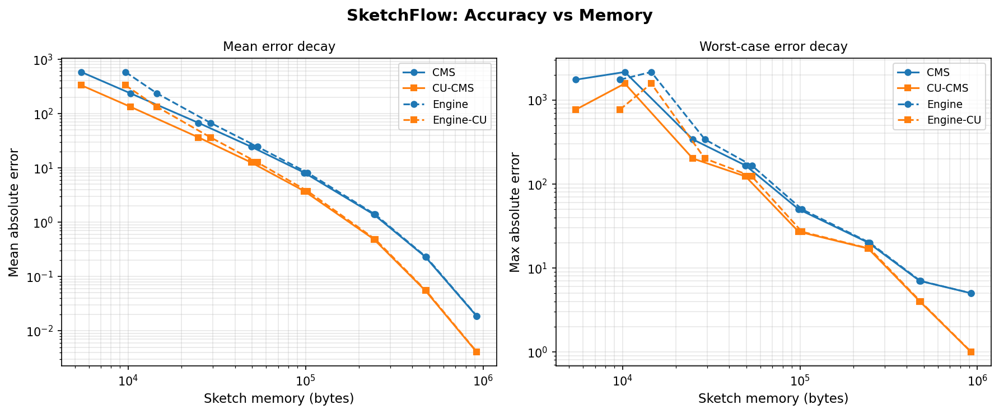

# SketchFlow — a Count-Min Sketch you can *break*

A from-scratch, sublinear **stream-counting engine** for network traffic — built one honest step at a time.

[](https://github.com/neil-cipher/sketchflow/actions/workflows/ci.yml)
&nbsp;
&nbsp;261 tests · steps 0–26 green · MIT licensed · zero novelty claims

> **The hook:** most "probabilistic data structure" repos implement Count-Min Sketch, Bloom, HyperLogLog and stop. SketchFlow does the opposite of breadth: it takes **one** structure — the Count-Min Sketch (and its conservative-update variant) — and **tries to break it.** An adversarial stream generator deliberately stresses the ε/δ error guarantee, and the engine measures **where the textbook bound holds and where it fails**, on real backbone-network traffic (MAWI, CIC-IDS-2017).

This is an **empirical study + reproducibility report**, *not* a whitepaper, and it makes **no claim of algorithmic novelty** — the algorithms are 20+ years public domain (Cormode & Muthukrishnan 2005; conservative update: Estan & Varghese 2002). The contribution is an honest, reproducible measurement of a guarantee under stress.

### What's inside (frozen scope)
- **Count-Min Sketch** + **conservative-update CMS** — from scratch, with ε/δ ↔ (width, depth) sizing and the never-undercount invariant tested.
- **Space-Saving** top-k heavy hitters (min-heap + hash index).
- **Bloom filter** — a warm-up "have I seen this flow?" gate.
- **Exact `dict`/`set` baseline** — ground truth for every accuracy/memory comparison.
- **Adversarial stream generator** — the standout: inputs designed to violate the guarantee.
- **Reproducible benchmark harness** → CSV + plots + a written [empirical study](report/EMPIRICAL_STUDY.md).

### Results in four numbers (all regenerated from seeds; see the [study](report/EMPIRICAL_STUDY.md))

| Question | Finding | Evidence |
|---|---|---|
| Does conservative update buy accuracy? | **Yes — it halves mean error.** At ε=0.01 on a 50k Zipfian stream, plain CMS mean abs-error **24.46** → CU-CMS **12.56**, top-10 heavy hitters exact for both. | [`report/results.csv`](report/results.csv) |
| Is the sketch actually smaller than a dict? | **Only until you over-size it.** At ε=0.01 the sketch is **14%** of the exact-dict memory; at ε=0.001 it *exceeds* the dict (ratio **1.39**) — an honest CPython-overhead crossover, reported not hidden. | [`report/results.csv`](report/results.csv) |
| Does conservative update defend against attack? | **No.** Under a white-box full-row collision attack, both plain and CU hit **violation rate 1.0** — CU degenerates into plain CMS. Defense is **sizing + a secret seed**, not CU. | [`report/adversarial.csv`](report/adversarial.csv) |
| Can traffic *volume* alone break the bound? | **Not the textbook bound.** A well-sized CMS is immune to x50 volumetric amplification on real MAWI traffic (mean error **22.2 → 23.0**, theorem violation ≤ **0.0009**). Only an *under-provisioned* sketch breaks the operator's fixed baseline promise. | [`report/real_adversarial.png`](report/real_adversarial.png) |



### Verify me in 5 minutes
```bash
git clone https://github.com/neil-cipher/sketchflow && cd sketchflow
pip install -r requirements.txt

PYTHONPATH=src pytest -q     # 261 tests: estimate never undercounts; error within εN; δ-promise holds
make reproduce               # rebuilds every CSV + figure in report/ from fixed seeds
make coverage                # line-coverage report + refreshes the coverage badge (floor 90%, CI-enforced)
```
What you should see: all **261 tests green** in under two minutes, and `report/` regenerated byte-for-byte on the seeded error/violation columns. CI runs this exact sequence on a wiped checkout on every push — plus a third job that enforces a **≥ 90% line-coverage floor** (`report/coverage.svg` is a static, secret-free badge, no upload token) — so the study can never silently drift from the code. Prefer to just read? The whole thing is written up in [`report/EMPIRICAL_STUDY.md`](report/EMPIRICAL_STUDY.md), and every design decision is logged in [`.project-meta/decisions.log`](.project-meta/decisions.log).

### Pedagogy index — one concept per build step
Every commit drilled exactly one idea. The full 4-line notes live in [`.project-meta/decisions.log`](.project-meta/decisions.log); the map:

| Steps | Phase | Concepts drilled |
|---|---|---|
| 0–1 | Scaffold + baseline | reproducible CI from day one · Zipfian streams · exact `dict`/`set` ground truth |
| 2–4 | Hashing + Bloom | tabulation (Zobrist) hashing & k-independence · Bloom filter + FPR sizing |
| 5–8 | Count-Min core | CMS counter matrix · never-undercount invariant · ε/δ ↔ (width, depth) sizing · honest memory accounting + serialization · inner-product / join-size estimation |
| 9–12 | Variants + engine | conservative update · Space-Saving top-k · min-heap + hash index for O(log k) · composing CMS + Space-Saving into one engine |
| 13–14 | Benchmark harness | seeded error/memory measurement → CSV · accuracy-vs-memory sweep + matplotlib plot |
| 15–18 | Real traffic | loading CIC-IDS-2017 flows · parsing a MAWI backbone pcap with `dpkt` |
| 19–22 | Adversarial stress *(the standout)* | white-box collision attack (Crosby–Wallach model) · empirical guarantee-violation meter · CU is not a defense · self-scaling theorem bound vs fixed provisioned promise on real traces |
| 23–25 | Write-up + reproducibility | honest empirical report with a cited source per claim · one-command `make reproduce` enforced in CI · this README |
| 26 | Shipping | final invariant sweep across the whole stack in one file · secret-free static coverage badge + CI-enforced ≥ 90% line-coverage floor · the `green-sketchflow-final` checkpoint tag |

### Literature (so you know I read it before I measured it)
Cormode & Muthukrishnan 2005 (CMS) · Estan & Varghese 2002 (conservative update) · Metwally et al. 2005 (Space-Saving) · Bloom 1970 · Crosby & Wallach 2003 (hash-flooding threat model) · Zobrist 1970 / Pătrașcu & Thorup 2012 (tabulation hashing). Full reference list with the exact claim each source backs: [`report/EMPIRICAL_STUDY.md`](report/EMPIRICAL_STUDY.md#references).

---
*Built by [@neil-cipher](https://github.com/neil-cipher) · VIT Vellore CSE (Core) · Semester-1 flagship. Every commit adds a real, tested capability and a 4-line note on the concept it drills. No green-square farming. Licensed under [MIT](LICENSE).*
